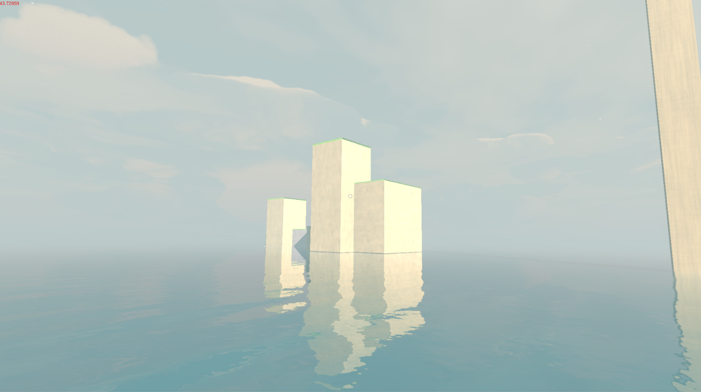
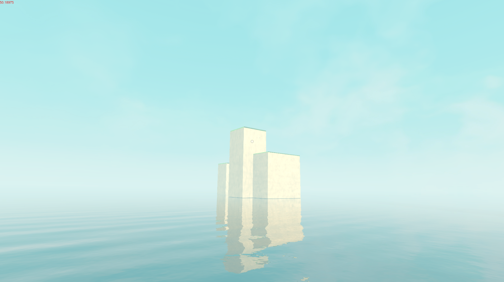

# Post-processing Demo

Demos for post-processing learning.

Develop with Unity 2019.2.6f1

Implement by extending Unity Built-in Render Pipeline with Command Buffer.

## Implemented Post-processings
- Fog.
- Infinite water reflection. (See [https://www.sardinefish.com/blog/?pid=342](https://www.sardinefish.com/blog/?pid=342))
- Atmosphic scattering.
- Volumeric shadow.
- Screen Space Ambient Occlusion.
- Bloom.
- Post color processing.

